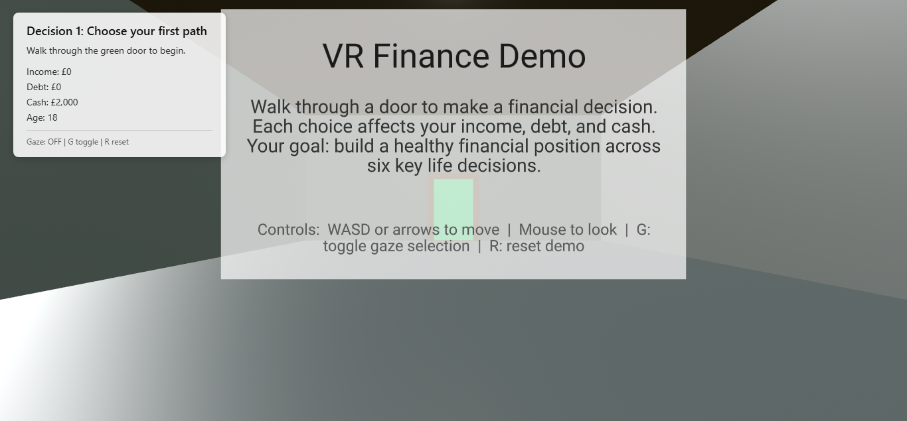
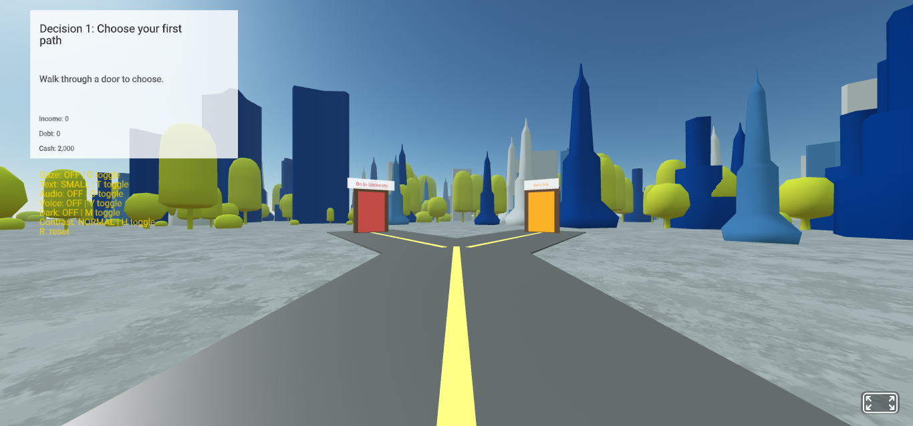
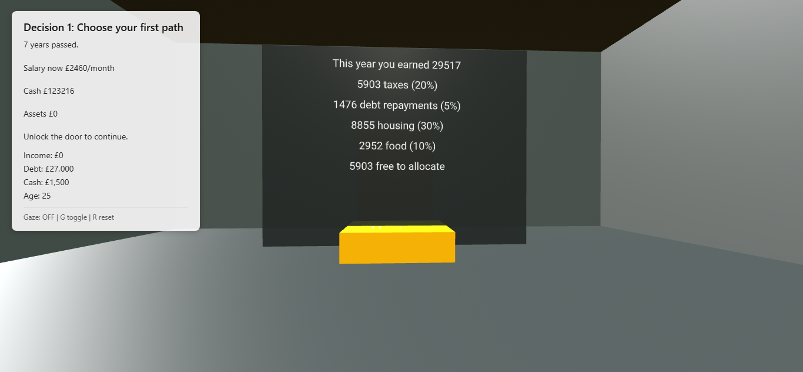
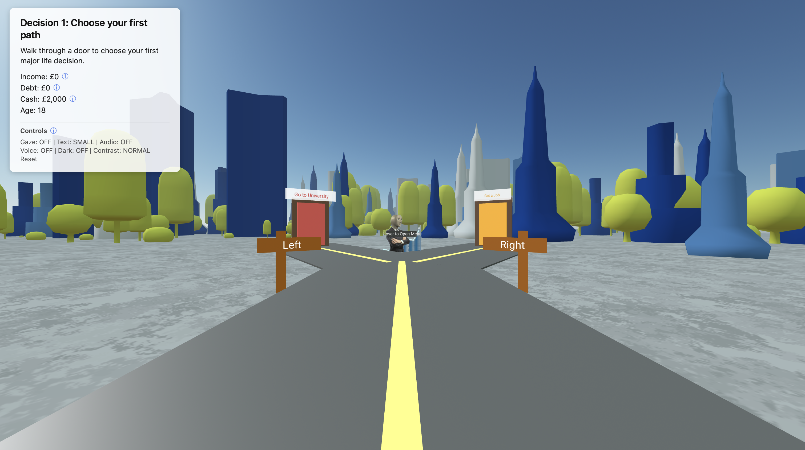
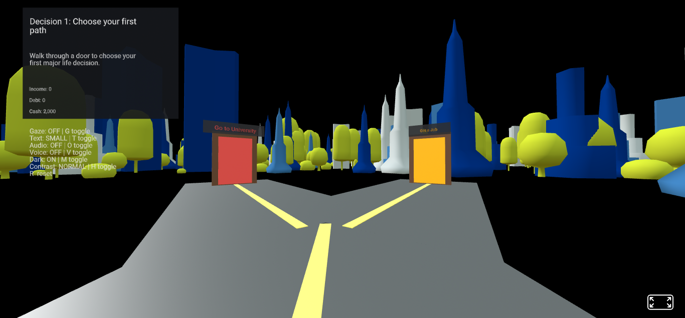
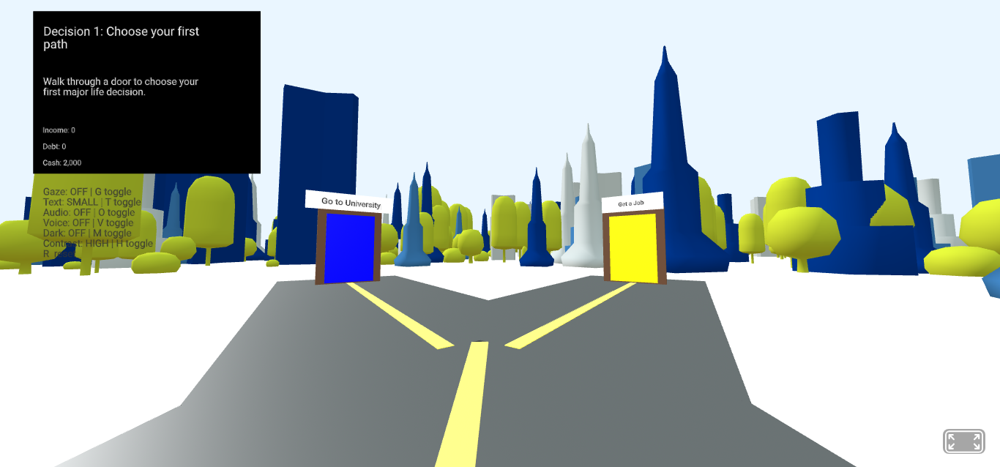
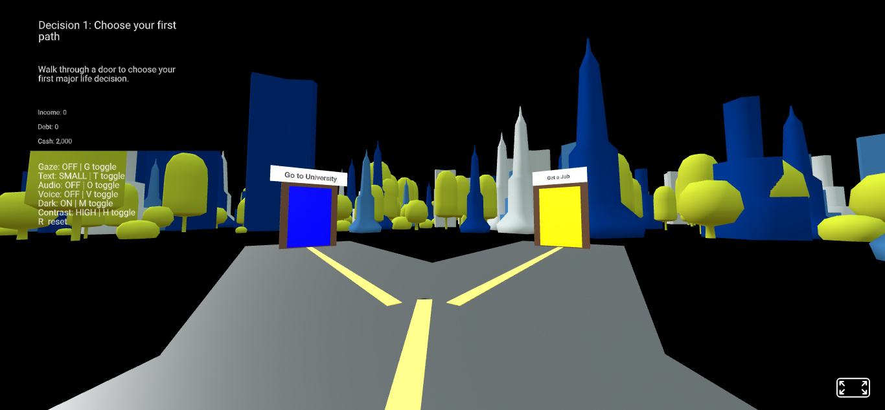

# CashQuest: VR Finance Simulator

## Overview

CashQuest is an educational Virtual Reality (VR) finance simulator developed using A-Frame, JavaScript, HTML, and CSS.

The project was designed to improve financial literacy by allowing users to experience the long-term consequences of financial decisions within an immersive virtual environment. Players progress through a series of life choices that influence income, debt, savings, investments, and overall financial wellbeing.

In addition to decision-making activities, users allocate disposable income between debt repayment, savings products, and investments using interactive VR interfaces. The application combines experiential learning with accessibility-focused design to create an engaging and inclusive educational experience.

---

## Features

### Interactive Life Decisions

Players progress through a series of major financial decisions:

- University or employment
- Renting or buying a home
- Shared accommodation or living alone
- Car ownership or public transport
- Debt repayment or investing
- Career advancement opportunities

Each choice affects future financial outcomes, creating different pathways through the simulation.

### Financial Allocation Activities

After each life stage, users allocate disposable income across:

- Debt repayment
- Savings
- Investments

Interactive VR sliders provide real-time feedback showing how allocation decisions affect financial outcomes.

### Savings and Investment Simulation

Users can distribute savings between:

- Savings Accounts
- Cash ISAs
- Lifetime ISAs (LISAs)
- Bonds

The simulator models:

- Annual contribution limits
- Government LISA bonuses
- Interest growth
- Long-term asset accumulation

This encourages realistic financial planning behaviours.

### Educational Content

Each decision is accompanied by financial facts and educational explanations designed to improve financial literacy.

Examples include:

- Student debt and graduate earnings
- Property ownership versus renting
- Transport costs
- Investment fundamentals
- Debt repayment strategies

---

## Accessibility Features

Accessibility was a key design requirement throughout development.

### Interaction Accessibility

- Gaze-based interaction
- Mouse interaction
- Keyboard shortcuts
- Voice commands

### Visual Accessibility

- Adjustable text size
- Dark mode
- High contrast mode
- Scalable UI elements

### Audio Accessibility

- Audio narration
- Speech feedback
- Voice recognition controls

These features support users with a wide range of visual, motor, and cognitive accessibility needs.

---

## Controls

### Keyboard Shortcuts

| Key | Action                    |
| --- | ------------------------- |
| G   | Toggle gaze interaction   |
| T   | Toggle large text mode    |
| O   | Toggle audio narration    |
| V   | Toggle voice commands     |
| M   | Toggle dark mode          |
| H   | Toggle high contrast mode |
| R   | Reset simulation          |

### Movement Controls

| Control       | Action                  |
| ------------- | ----------------------- |
| W / A / S / D | Move around environment |
| Arrow Keys    | Alternative movement    |
| Mouse         | Look around             |
| Click / Gaze  | Interact with objects   |

---

## Voice Commands

Supported commands include:

- start
- begin
- left
- right
- next
- submit
- exit
- audio on
- audio off
- dark on
- dark off
- contrast on
- contrast off
- gaze on
- gaze off
- text large
- text small
- reset

---

## Technologies Used

### Frontend

- A-Frame
- HTML5
- CSS3
- JavaScript (ES6)

### VR & Graphics

- Three.js (via A-Frame)
- A-Frame Environment Component

### Accessibility

- Web Speech API
- Speech Synthesis API
- Speech Recognition API

### Visualisation

- Chart.js

---

## Project Structure

```text
cashquest-vr-finance-simulator/
│
├── index.html
├── style.css
├── README.md
│
├── screenshots/
│
├── js/
│   ├── accessibility.js
│   ├── decisions.js
│   ├── finance.js
│   ├── fixed_rates.js
│   ├── player.js
│   ├── ui.js
│   ├── vr-demo4.js
│   │
│   └── components/
│       ├── slider-component.js
│       └── time-system.js
```

---

## Installation

### Clone Repository

```bash
git clone https://github.com/Salmah1/cashquest-vr-finance-simulator.git
cd cashquest-vr-finance-simulator
```

### Run Locally

Using Python:

```bash
python3 -m http.server 8000
```

Open:

```text
http://localhost:8000
```

Alternatively, use the Live Server extension in Visual Studio Code.

---

## Screenshots

### Entrance Room



### Main Environment



### Financial Breakdown Screen



### Consequence Dialogue



### Large Text Mode and Dark Mode



### High Contrast Mode with Voice Commands



### Combined Accessibility Features



---

## Academic Context

This project was developed as part of a university computing degree programme and demonstrates:

- Virtual Reality development
- Human-Computer Interaction principles
- Accessibility-focused design
- Financial education technology
- Interactive simulation development
- JavaScript software engineering practices
